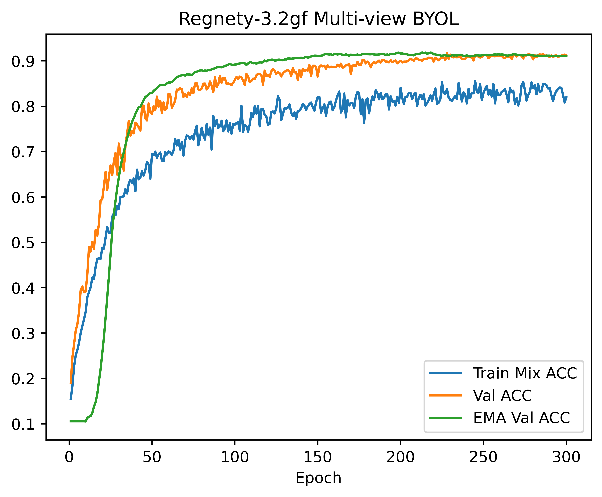

# Food11 From-Scratch Recipes
> Clean & solid baseline solutions for pure scratch training on the Food11 dataset

Fed up with bulky pretrained weights and blind .finetune() calls? This repo proves **90%+ validation accuracy can be achieved purely from scratch**. Such performance is attainable on a small dataset containing only 9K training images, without borrowing any external pretrained data knowledge.


## 🧪 Recipes Overview
All results below are obtained via pure scratch training with diverse network architectures and optimization strategies.

| Script File | Validation Accuracy |
| --- | --- |
| [`resnet50_baseline.py`](./recipes/resnet50_baseline.py) | 0.8831 |
| [`resnet50_cbam.py`](./recipes/resnet50_cbam.py) | 0.8921 |
| [`regnety_800mf_baseline.py`](./recipes/regnety_800mf_baseline.py) 🌟 | 0.9012 |
| [`regnety_800mf_coordattn_persample_cutmix.py`](./recipes/regnety_800mf_coordattn_persample_cutmix.py) | 0.9023 |
| [`resnet50_cbam_byol.py`](./recipes/resnet50_cbam_byol.py) | 0.9079 |
| [`regnety_3.2gf_byol.py`](./recipes/regnety_3.2gf_byol.py) | 0.9146 |
| [`regnety_3.2gf_mv_byol.py`](./recipes/regnety_3.2gf_mv_byol.py) 🚀 | **0.9184** |
| [`convnext_base_1000_epoch.py`](./recipes/convnext_base_1000_epoch.py) | 0.8843 |

> Tip: Click the link to access those top-performing implementation. You can conveniently modify and extend the code for your own usage.





### 🌟 Core Baseline: RegNetY (0.9012)

It acts as the most stable starting point for subsequent optimization. To hit over 90% accuracy via full scratch training on a 9K-image dataset, proper balance between model capacity and regularization is essential. RegNetY-800MF provides a solid and steady baseline solution.


### 🔧 Optimized Training Schemes
Extended experimental scripts integrate various effective optimization modules, including CBAM, CoordAttn, standard BYOL and Multi-View BYOL (MV-BYOL).

> **Important Remarks**
These solutions stay in experimental status. Though they boost validation accuracy to 91.84%, they have not been fully optimized. (e.g. Hyperparameters and loss coefficients remain untuned for optimal performance.)


### 🏔️ Further Optimization Directions
Existing transfer learning methods based on ImageNet pretrained weights can easily reach around 97% accuracy on Food11. Pure scratch training has already broken the ~92% accuracy mark, steadily narrowing the performance gap with huge potential for further improvement.

Here are reliable optimization paths to boost accuracy further:
- **Test Time Augmentation (TTA)**
- **Transductive Learning**
- **K-Fold Ensembling**
- **In-depth Hyperparameter Tuning**

More promising strategies worth exploring:
- **Self-Distillation Training**
- **Advanced Self-Supervised Learning**
- **Training with Progressive Image Resizing**
- **Using More Advanced Model Architectures**


## 📦 Setup & Usage

## Recommended Hardware
- **GPU with ≥20GB VRAM** (e.g., RTX A6000, RTX 4090, A100, V100)
- CUDA support is **required** (the code is fully optimized for GPU)

### Installation
```bash
pip install torch torchvision torchmetrics tqdm numpy pillow
```

### Dataset Structure
This project uses the standard **Food11** dataset with the following structure:
```
food11/
├── training/
│   └── {class}_{index}.jpg  (e.g., 2_100.jpg)
├── validation/
│   └── {class}_{index}.jpg  (e.g., 3_100.jpg)
└── test/
    └── {index}.jpg          (unlabeled)
```

The original dataset can be downloaded via this [`link`](https://github.com/virginiakm1988/ML2022-Spring/blob/main/HW03/food11.zip?raw=true).

### Dataset Statistics
- Training: 9,866 images (11 classes)
- Validation: 3,430 images (11 classes)
- Test: 3,347 images (unlabeled)

All images are loaded **directly into GPU memory** for fastest training.


### How to Run
#### Train a model
Run any recipe script directly to start training:
```bash
python ./recipes/regnety_800mf_baseline.py
```

#### Evaluate a checkpoint
Compute validation accuracy using a trained checkpoint:
```bash
python ./utils/score.py --ckpt checkpoint_path.pt --split val
```

#### Test set inference & submission
Run inference on the test set and generate `submission.csv`:
```bash
python ./utils/score.py --ckpt best_food11_regnety.pt --split test --output
```

## ⭐ Star Support
If you find these from-scratch training solutions useful, please feel free to leave a star.
Further optimizations may be added occasionally.
